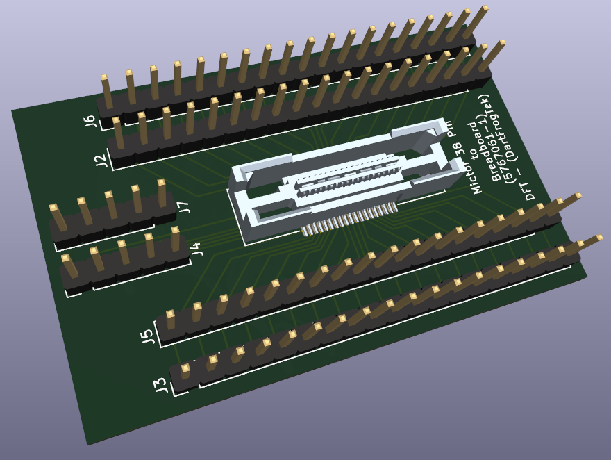
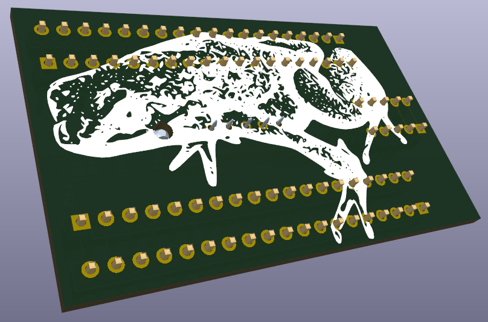

# Mictor 38Pin to Breadboard
A Mictor 38 Pin to Breadboard adapter. Allows Mictor connectors for high end Logic Analyzers to interface with breadboard and/or prototype PCBs.

Renders show dual Male Pin Headers on the top in all spaces. Instead you can place a Female Socket or a set of Male Pins. I would place male pins on bottom side in J2/J5/J4 and solder from top. You can either leave J3/J6/J7 empty or you can add male pins or female sockets to the top if desired. J2/J6 are connected. J4/J7 are connected. J5/J3 are connected.

Order from PCBWay with my shared project!
https://www.pcbway.com/project/shareproject/Mictor_38Pin_Logic_Analyzer_Probe_Breakout_98119768.html

### Female Mictor 38 Pin Connector
TE Connectivity AMP Connectors [5767061-1](https://www.digikey.com/en/products/detail/te-connectivity-amp-connectors/5767061-1/2195045)

### Renders

